# Report on lab1
## Завдання на лабораторну роботу.
### 1. Зареєструватись в системі під обліковим записом, що збігається з логіном студентської пошти (формат n.surname).

---

### 2. Використовуючи команду passwd, змінити пароль. Вивчити основні параметри команди. Який системний файл вона змінює?

#### Рішення:
Вона змінює файл /etc/shadow.

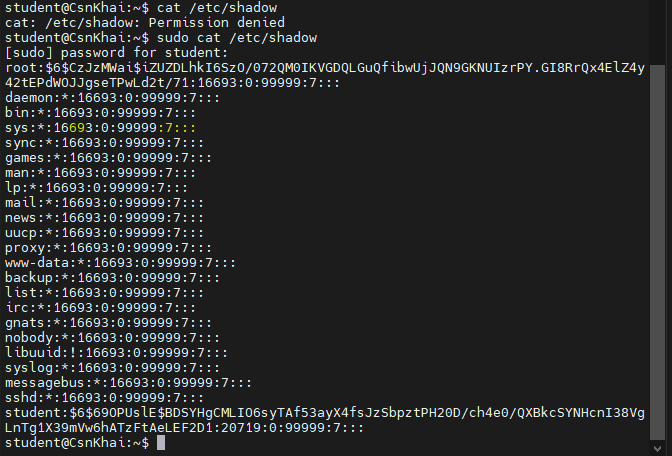

Також читає та використовує файл /etc/passwd.

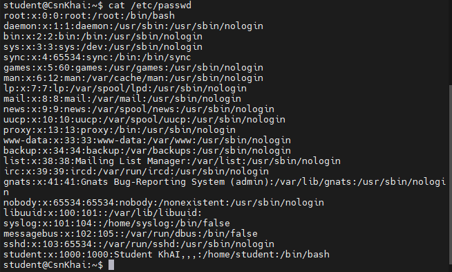

---

### 3. Визначити користувачів, зареєстрованих у системі, і які команди вони виконують. Яку додаткову інформацію можна отримати при виконанні команди?

```
student@CsnKhai:~$ w
 14:58:53 up 26 min,  2 users,  load average: 0.00, 0.01, 0.02
USER     TTY      FROM             LOGIN@   IDLE   JCPU   PCPU WHAT
student  tty1                      14:32   26:20   0.03s  0.02s -bash
student  pts/0    192.168.0.162    14:33    0.00s  0.03s  0.00s w
student@CsnKhai:~$ 
```

Користувач 1: student, виконує -bash.
Користувач 2: student, виконує команду w.
Команда також дозволяє отримати поточний час, скільки система працює, кількість активних користувачів, середнє навантаження системи, час входу користувача, час простою інтервалу, поточну команду або процес які виконує користувач, IP-адресу віддаленого підключення та використання CPU.

---

### 4. Змінити особисту інформацію.

Вигляд спочатку:
```
student@CsnKhai:~$ finger student
Login: student                          Name: Student KhAI
Directory: /home/student                Shell: /bin/bash
On since Wed Sep 23 14:32 (UTC) on tty1    59 minutes 54 seconds idle
     (messages off)
On since Wed Sep 23 14:33 (UTC) on pts/0 from 192.168.0.162
   6 seconds idle
No mail.
No Plan.
```

Вигляд після змінення інформації:
```
student@CsnKhai:~$ finger student
Login: student                          Name: Student KhAI
Directory: /home/student                Shell: /bin/bash
Office: 67, x6969                       Home Phone: x6969
On since Wed Sep 23 14:32 (UTC) on tty1    1 hour 3 minutes idle
     (messages off)
On since Wed Sep 23 14:33 (UTC) on pts/0 from 192.168.0.162
   5 seconds idle
No mail.
Plan:
I'm working on lab 1...
```

---

### 5. Освоїти довідкову систему Linux, а також команди man та info. Отримати довідку за розглянутими раніше командами, визначити та описати два ключі для даних команд. Навести приклади.

Довідка команди passwd (команда man passwd):

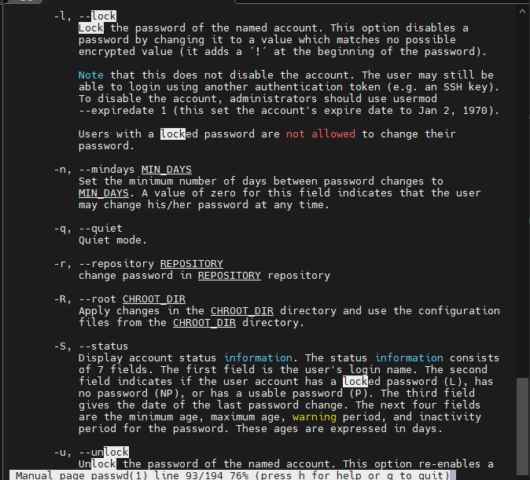

Довідка команди finger (команда man finger):

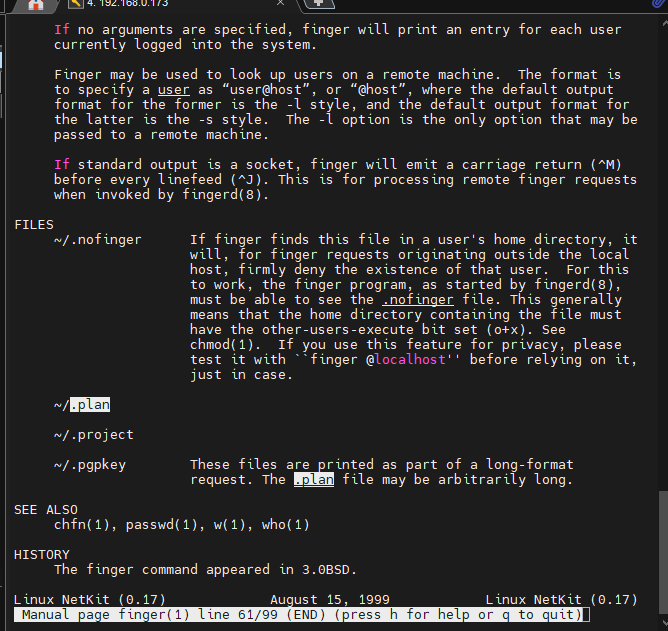

---

### 6. Вивчити команди more та less за допомогою довідкової системи. За допомогою команд переглянути вміст файлів .bash*.

Команда more:

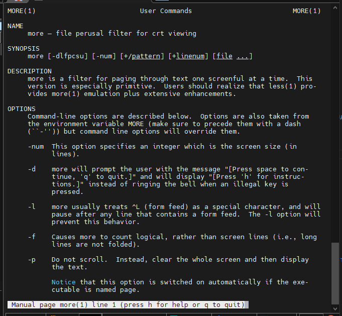

Команда less:

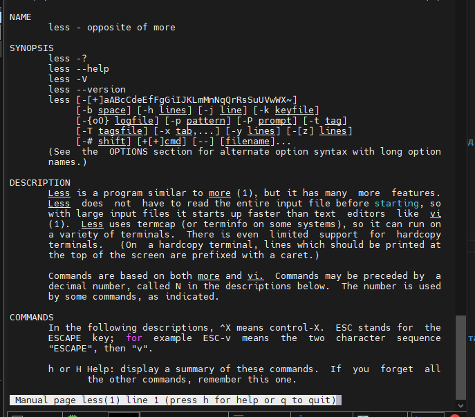

Вміст файлу .bash_logout через less:

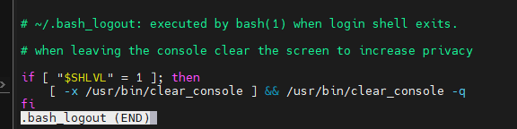

Вміст файлу .bash_history через less:

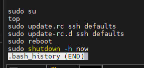

Вміст файлу .bash_logout через more:

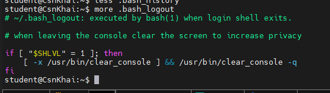

Вміст файлу .bash_history через more:

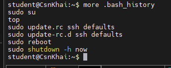

---

### 7. Описати в планах те, що ви працюєте над лабораторною роботою №1.

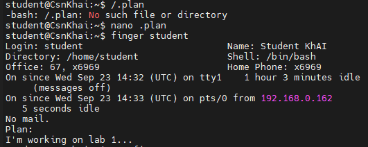

---

### 8. Вивести вміст домашнього каталогу за допомогою команди ls, визначити його файли та каталоги.

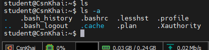

Команда ls не вивела об'єктів, оскільки в каталозі відсутні звичайні видимі файли та каталоги. Для перегляду файлів та каталогів використали команду ls -a. У результаті виявлено файли .bash_history, .bash_logout, .bashrc, .lesshst, .plan, .profile, .Xauthority та каталоги .cache, . та ..

---